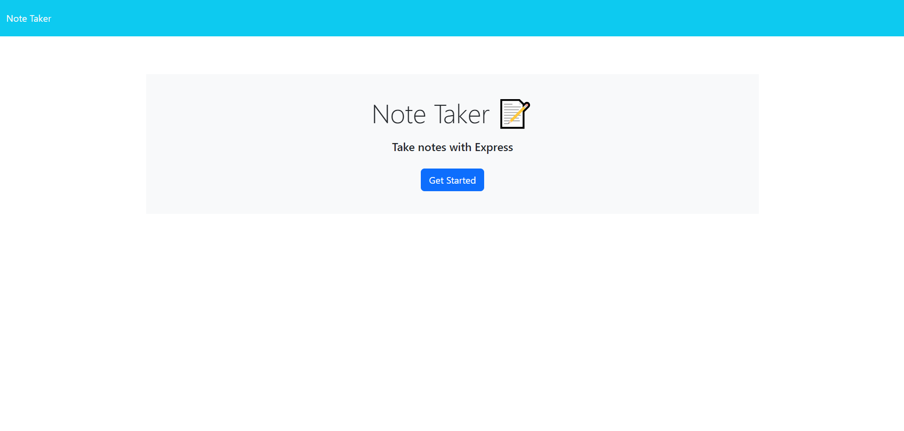

# Express Note Taker

## Description
Simple application that uses node.js and express.js to host a simple note taking website.

## Installtion
Clone the repository then open it in your terminal. Run npm i to install the required dependencies. Run node server.js in terminal to start the server.

## Usage
Navigate to https://localhost:3001/ in your browser. Click the get started button to be taken to the notes page. Type in the from provided for Notes Title, and Note text. Press save to save the note. Click on the notes list on the left to bring up a past note. Use the trashcan icon to delete a note.

## Screen shot

## License

N/A